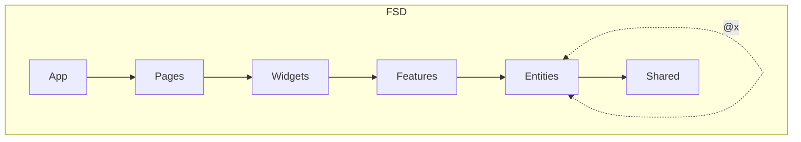

# Easy Trello

## 🚩 Table of Contents
- [Packages](#Packages)
- [Structure](#structure)

---

## Get started

### Prerequisites
1. Node >= v18.13.0 
2. pnpm >= 7.5.2

### Installation

1. Clone this repository
```bash
  git clone git@github.com:Philian73/easy-trello.git
```
2. Install dependencies
```bash
  pnpm i
```
3. Enable "EsLint" and "Prettier" in your IDE for all rules to work


4. Start dev server
```bash
  pnpm run dev
```
---

## Structure

#### [Feature-Sliced Design (FSD)](https://feature-sliced.design/ru/)
1. Cross-imports at the entity level are allowed with control via "@x", [discussions](https://github.com/feature-sliced/documentation/discussions/390) on this topic
2. "Features" - is more than just a use-case-features from standard FSD



---
## Packages:

|                          | **LIBS**                                                                                                                                                                                                                                  |
|--------------------------|-------------------------------------------------------------------------------------------------------------------------------------------------------------------------------------------------------------------------------------------|
| **Main**                 | React + TypeScript                                                                                                                                                                                                                        |
| **Router**               | [React-router-dom](https://www.npmjs.com/package/react-router-dom)                                                                                                                                                                        |
| **State Managers**       | [Zustand](https://www.npmjs.com/package/zustand), [TanStack Query (React query)](https://www.npmjs.com/package/@tanstack/react-query) + devtools                                                                                          |
| **API**                  | [Axios](https://www.npmjs.com/package/axios)                                                                                                                                                                                              |
| **Permissions**          | [Casl/ability](https://www.npmjs.com/package/@casl/ability)                                                                                                                                                                               |
| **Internationalization** | [i18next](https://www.npmjs.com/package/i18next) + plugins: [browser-languagedetector](https://www.npmjs.com/package/i18next-browser-languagedetector), [http-backend](https://www.npmjs.com/package/i18next-http-backend)                |
| **Forms**                | [React-hook-form](https://www.npmjs.com/package/react-hook-form) + devtools                                                                                                                                                               |
| **Validators**           | Simple, native from react-hook-form                                                                                                                                                                                                       |
| **Primitives**           | [Headless UI](https://www.npmjs.com/package/@headlessui/react), [react-beautiful-dnd](https://www.npmjs.com/package/react-beautiful-dnd) (for dnd board)                                                                                  |
| **Styles**               | [Tailwind CSS](https://www.npmjs.com/package/tailwindcss) + [postcss](https://www.npmjs.com/package/postcss) + [autoprefixer](https://www.npmjs.com/package/autoprefixer), [clsx](https://www.npmjs.com/package/clsx)                     |
| **Other**                | [Orval](https://www.npmjs.com/package/orval) (generate api), [immer](https://www.npmjs.com/package/immer), [nanoid](https://www.npmjs.com/package/nanoid), [react-toastify](https://www.npmjs.com/package/react-toastify) (Notifications) |
| **Backend**              | [MSW](https://www.npmjs.com/package/msw) (mock) + [localforage](https://www.npmjs.com/package/localforage) (IndexedDB)                                                                                                                    |