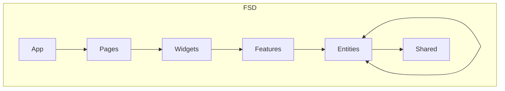

# Easy Trello

## Get started

### Prerequisites
1. Node >= v18.13.0 
2. pnpm >= 7.5.2

### Installation

1. Clone this repository
```bash
  git clone git@github.com:Philian73/easy-trello.git
```
2. Install dependencies
```bash
  pnpm i
```
3. Start dev server
```bash
  pnpm dev
```
---

## Structure

#### Feature-Sliced Design
1. Cross-imports at the entity level are allowed with control via "@x", [discussions](https://github.com/feature-sliced/documentation/discussions/390) on this topic
2. "Features" - is more than just a use-case-features from standard FSD



---
## Technologies:
- `Main`: React + TypeScript
- `Router`: React-router-dom
- `State managers`: Zustand + Context API, TanStack Query(React Query) + devtools (dev mode)
- `API`: REST: Axios
- `Permissions`: Casl/ability
- `Internationalization`: i18next / react-i18next / i18next-browser-languagedetector / i18next-http-backend
- `Forms`: React-hook-form + devtools (dev mode)
- `Validators`: simple, native from react-hook-form
- `Primitives`: Headless UI, react-beautiful-dnd (for dnd board)
- `Styles`: tailwindcss + postcss + autoprefixer, clsx
- `Other`: orval (generate api), immer, nanoid, react-toastify
- `Backend`: MSW (mock) + localforage (IndexedDB)
- [x] EsLint - Prohibition of cross imports, entry-point import (puclib api) and more
- [x] Prettier
---

### low coupling / high cohesion
(Everything depends on the “shared”, I didn’t indicate directions to it)


